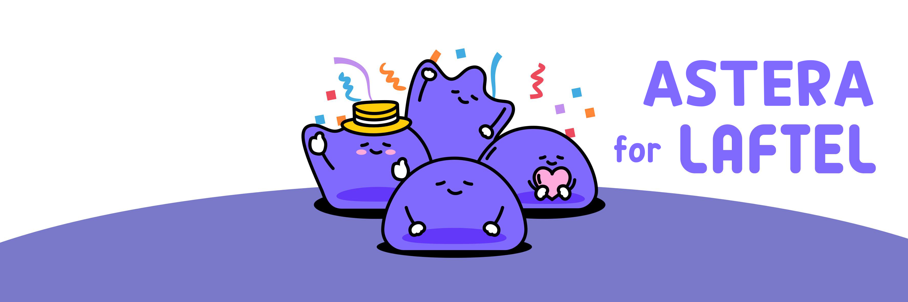

## What is this?

아스테라는 IT 분야에 꿈을 갖고 나아가길 원하는 사람들이 모여 공부하는 스터디 그룹입니다.
지금까지는 각자 다른 분야에서 공부를 해 왔지만, 이제는 IT라는 하나의 영역으로 모여 공부하고 있습니다.

아스테라 멤버들은 온라인 게임이라는 가상 공간에서 만난 사람들로 구성되어 있습니다.

아무나 함께한 것이 아닌, 진정으로 원하고, 열정이 넘치는 사람들로 구성되어 있습니다.

공통적으로 다들 애니메이션을 좋아합니다.

그렇기에 리디(LAFTEL), 미호요(MiHoYo)와 같은 기업을 목표로 하고 있습니다.

컴퓨터 공학을 전공하지 않았기에 많이 느리지만, 기본부터 잘 다지고 나가고 있습니다.

---

📖 스터디 정보

- 기간: 2021.10.01 ~ Endless
- 일시: 매주 월/목 오후 6시
  - 월요일: 공부한 내용 PPT를 통한 공유
  - 목요일: 공부한 것을 바탕으로 문제 풀이
- 장소: 디스코드 (온라인 스터디)

---

📚 스터디 내용

|  HTML   |  CSS   |  JavaScript   |  TypeScript   |  Node   |
| :-----: | :----: | :-----------: | :-----------: | :-----: |
| ![html] | ![css] | ![javascript] | ![typescript] | ![node] |

|   Next    |  Next  |    Notion     |  Notion   |  Figma   |
| :-------: | :----: | :-----------: | :-------: | :------: |
| ![nextjs] | ![CSS] | ![JavaScript] | ![notion] | ![figma] |

## Our Convention

## Studies Log

## License

### 함께 공부할 내용

<!-- References -->

[html]: ./images/stacks/html.svg
[css]: ./images/stacks/css.svg
[javascript]: ./images/stacks/javascript.svg
[typescript]: ./images/stacks/typescript.svg
[node]: ./images/stacks/node.svg
[react]: ./images/stacks/react.svg
[react-native]: ./images/stacks/react-native.svg
[nextjs]: ./images/stacks/nextjs.svg
[notion]: ./images/stacks/notion.svg
[figma]: ./images/stacks/figma.svg
